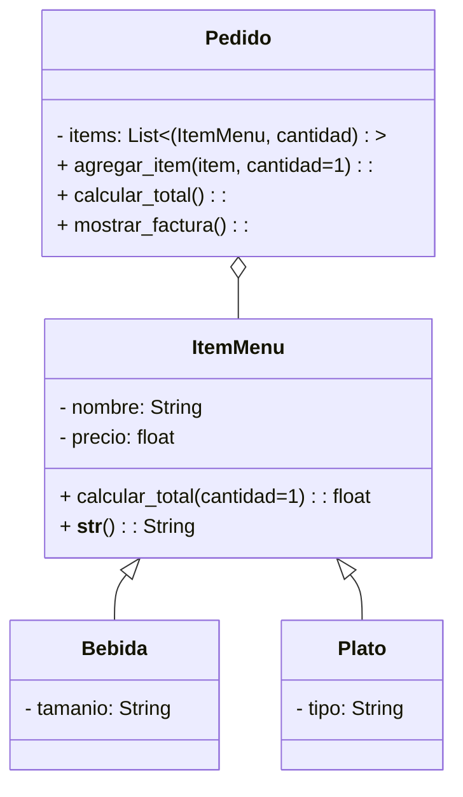

# Reto3_POO
Ejercicio de clase y del restaurante :D

```mermaid
classDiagram
  class ItemMenu {
  - nombre: String
  - precio: float
  + calcular_total(cantidad=1): float
  + __str__(): String
}

  class Bebida {
  - tamanio: String
}

  class Plato {
  - tipo: String
}

  class Pedido {
  - items: List<(ItemMenu, cantidad)>
  + agregar_item(item, cantidad=1): 
  + calcular_total(): 
  + mostrar_factura(): 
}

ItemMenu <|-- Bebida
ItemMenu <|-- Plato
Pedido o-- ItemMenu
```
